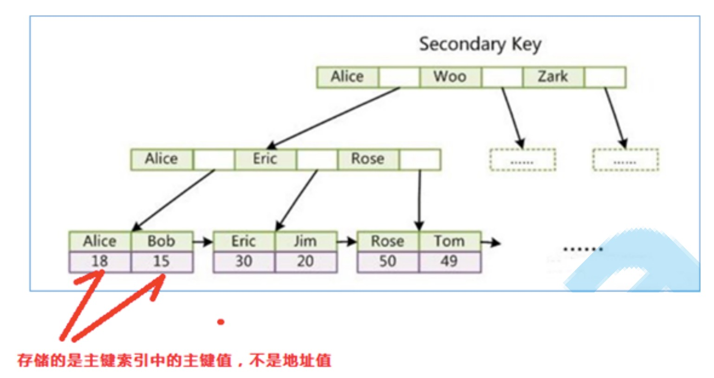
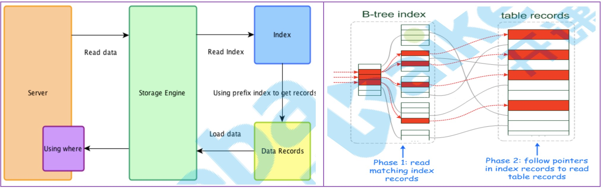
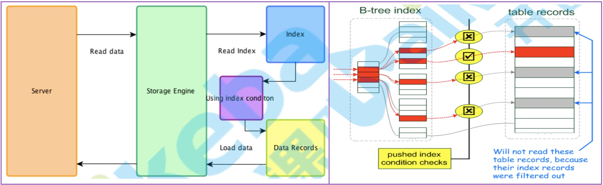
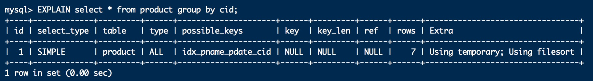

[TOC]

# 0、学习进度

C6-5 P1 00:24:00

# 1、MySQL架构

## 1.1、逻辑架构

### 1.1.1、连接器（Connectors）

* win黑窗口链接MySQL

~~~
mysql -h127.0.0.1 -P3306 -uroot -ppassword
~~~

### 1.1.2、系统管理与控制工具（Management Serveices & Utilities）

### 1.1.3、连接池（Connection Pool）

~~~
SQL Layer MySQL业务层（Service层）
~~~

### 1.1.4、SQL接口（Sql Interface）

~~~
接收SQL DML DDL
~~~

### 1.1.5、解析器（Parser）

~~~mysql
-- 形成正确语法树
select * from t1;
	-- 词法分析-分词 -> 形成语法树
	-- 语法分析-分析 -> 符合SQL的语法 SQL的语法 ： SQL 92 limit MYSQL自己的语法
elect * from t1;
	-- 语法错误 sytnx error ..
~~~

### 1.1.6、查询优化器（Optimizer）

~~~mysql
mysql觉得你写的SQL不是完美的，所以需要有查询优化器等存在。
~~~

### 1.1.7、查询缓存（Cache和Buffffer）

~~~mysql
-- 功能：把查询结果存起来
select * from tuser where id=1;

-- 将SQL语句通过哈希算法(hash(selectSql))计算出其哈希值，存入 Map<key, value>
hash(selectSql) -> key
	若sql有变化 就值不唯一。
	若数据有变化，缓存清除。 -- 糟心

MySQL8.0后不再使用
~~~

### 1.1.8、存储引擎（Pluggable Storage Engines）

* 语法

~~~mysql
-- 以表为单位，MySQL的存储引擎是针对表进行指定的。
create table product(...) engine=InnoDB/Memory/MyISAM;
~~~

* 分类

| 存储引擎            | 说明                                                         |
| ------------------- | ------------------------------------------------------------ |
| **MyISAM**          | 高速引擎，拥有较高的插入、查询速度，**但不支持事务、不支持行锁**。支持3种不同的存储格式。包括静态型、动态型和压缩型。 |
| **InnoDB**          | MySQL5.5版本后默认的存储引擎，**支持事务和行级锁定**，事务处理、回滚、崩溃修复能力和多版本并发控制的事务安全，比MyISAM处理速度稍慢、支持外键（FOREIGN KEY）。 |
| ISAM                | MyISAM的前身，MySQL5.0以后不再默认安装。                     |
| MRG_MyISAM（MERGE） | 将多个表联合成一个表使用，在超大规模数据存储时很有用。       |
| **Memory**          | 内存存储引擎，拥有极高的插入，更新和查询效率。但是会占用和数据量成正比的内存空间。只在内存上保存数据，意味着数据可能会丢失。 |
| Falcon              | 一种新的存储引擎，支持事物处理，传言可能是InnoDB的替代者。   |
| Archive             | 将数据压缩后进行存储，非常适合存储大量的独立的，作为历史记录的数据，但是只能进行插入和查询操作。 |
| CSV                 | CSV 存储引擎是基于 CSV 格式文件存储数据(应用于跨平台的数据。 |

* MyISAM与InnoDB比较

|      \       | InnoDB                                      | MyISAM                                              |
| :----------: | :------------------------------------------ | :-------------------------------------------------- |
| **存储文件** | .frm 表定义文件 .ibd 数据文件和索引文件 | .frm 表定义文件 .myd 数据文件 .myi 索引文件 |
|    **锁**    | 表锁、行锁                                  | 表锁                                                |
|   **事务**   | 支持                                        | 不支持                                              |
|   **CURD**   | 读、写                                      | 读多                                                |
|  **count**   | 扫表                                        | 专门存储的地方 （加where也扫表）                    |
| **索引结构** | B+ Tree                                     | B+ Tree                                             |
|   **外键**   | 支持                                        | 不支持                                              |

## 1.2、物理架构

### 1.2.1、数据文件

~~~mysql
SHOW VARIABLES LIKE '%datadir%';
~~~

`InnoDB数据文件`

* **.frm**文件： 
* **.ibd**文件：
* **.ibdata**文件：

`MyISAM数据文件`

* **.frm**文件：
* **.myd**文件：
* **.myi**文件：

### 1.2.2、日志文件

* 查看日志开启情况

~~~mysql
SHOW VARIABLES LIKE 'log_%';
~~~

* **错误日志**（error log）

~~~
默认是开启的，而且从5.5.7以后无法关闭错误日志。
错误日志记录了运行过程中遇到的所有严重的错误信息,以及 MySQL每次启动和关闭的详细信息。
~~~

* **二进制日志**（bin log）

~~~
记录数据变化，用来进行数据备份、恢复、主从。生产中开启。
binlog日志记录了数据库所有的ddl语句和dml语句，但不包括select语句内容，语句以事件的形式保存，描述了数据的变更顺序，binlog还包括了每个更新语句的执行时间信息。如果是DDL语句，则直接记录到binlog日志，而DML语句，必须通过事务提交才能记录到binlog中。
~~~

* **通用查询日志**（general query log）

~~~
生产中不开启
啥都记录，耗费性能
~~~

* **慢查询日志**（slow query log）

~~~
默认是关闭的。需要通过设置参数进行开启。
SQL调优时使用，用来定位慢的select。
~~~

~~~sh
# 进入mysql配置文件目录并编辑配置文件
vi /etc/my.cnf
~~~

~~~properties
# 开启慢查询日志
slow_query_log=ON
# 慢查询的阈值，记录执行时间超过long_query_time秒的所有查询，便于收集查询时间比较长的SQL语句
long_query_time=3
# 日志记录文件如果没有给出file_name值，默认为主机名，后缀为-slow.log。如果给出了文件名， 但不是绝对路径名，文件则写入数据目录。 
slow_query_log_file=file_name
~~~

* 重做日志（redo log）

~~~
帮助实现持久化事务处理。
~~~

* 回滚日志（undo log）

~~~
帮助实现回滚事务处理。
~~~

* 中继日志（relay log）

~~~
与bin log里的内容一致
~~~

### 1.2.3、文件写入顺序

* 日志文件

~~~
日志文件写入顺序：顺序写入
顺序写入只需要一次寻道（磁道地址），所以其执行速度快，耗费时间短。
~~~

* 数据文件

~~~
数据文件写入顺序：随机写入
随机写入需要多次寻道，所以其执行速度慢，耗费时间长。
~~~

* 数据文件为什么选择随机写入

~~~
因为数据文件中存在大量的新增或删除的操作，若使用顺序写入，则在进行删除操作的时候，会删除连续磁道中的片段，导致该片段无法复用，从而产生磁道碎片。
数据磁盘落盘利用日志文件去提升IO性能。
~~~

# 2、索引

## 2.1、索引的应用

### 2.1.1、索引的利弊

* 利

~~~
检索：可以提高数据检索的效率，降低数据库的IO成本，类似于书的目录。
排序：通过索引列对数据进行排序，降低数据排序的成本，降低了CPU的消耗。
	-- 被索引的列会自动进行排序，包括[单列索引]和[组合索引]，只是组合索引的排序要复杂一些。
	-- 如果按照索引列的顺序进行排序，对应order by语句来说，效率就会提高很多。
索引下推：server层不能处理的索引，可以通过索引下推(ICP)在存储引擎层处理。
索引覆盖：在满足覆盖索引条件时，可以避免回表查询。
~~~

* 弊

~~~
索引会占据磁盘空间.
索引虽然会提高查询效率，但是会降低更新表的效率。比如每次对表进行增删改操作，MySQL不仅要保存数据，还有保存或者更新对应的索引文件。
~~~

### 2.1.2、索引的分类与创建

#### 单列索引

* 创建

~~~mysql
-- 普通索引（2种）
CREATE INDEX indexName ON tableName(columnName(length));
ALTER TABLE tableName ADD INDEX indexName(columnName(length));

-- 唯一索引（2种）
CREATE UNIQUE INDEX indexName ON tableName(columnName(length));
ALTER TABLE tableName ADD UNIQUE INDEX indexName(columnName);
~~~

#### 组合索引

* 创建

~~~mysql
ALTER TABLE article ADD INDEX index_title_time (title(50), time(10));
-- 注意，title可能长度不止50（假设为100），那么组合索引种title(50)即取title字段最左50长度作为索引，后50个就不走索引。
-- 只要是组合索引，除了联合主键外，一定属于辅助索引。
~~~

#### [全文索引](http://blog.itpub.net/26736162/viewspace-2144690/)

* 说明

~~~
全文索引（也称全文检索）是目前搜索引擎使用的一种关键技术。它能够利用【分词技术】等多种算法智能分析出文本文字中关键词的频率和重要性，然后按照一定的算法规则智能地筛选出我们想要的搜索结果。
~~~

* 创建

~~~mysql
-- 全文索引（2种）
CREATE FULLTEXT INDEX indexName ON tableName(columnName(length));
ALTER TABLE tableName ADD FULLTEXT indexName(columnName);
~~~

* 注意

  * MySql自带的全文索引只能用于数据库引擎为**MYISAM**的数据表，如果是其他数据引擎，则全文索引不会生效。

  * MySql**自带**的全文索引**只能对英文**进行全文检索，目前无法对中文进行全文检索。如果需要对包含中文在内的文本数据进行全文检索，我们需要采用[Sphinx(斯芬克斯)](https://www.runoob.com/w3cnote/sphinx-sql-search-engine.html) / [Coreseek](https://blog.csdn.net/m493096871/article/details/83994588)技术来处理中文。

  * 目前，使用MySql自带的全文索引时，如果查询字符串的长度过短将无法得到期望的搜索结果。MySql全文索引所能找到的词默认最小长度为4个字符。另外，如果查询的字符串包含停止词，那么该停止词将会被忽略，可以通过修改 my.cnf 修改参数`ft_min_word_len=3` 并重启刷新。

  * 如果可能，请尽量先创建表并插入所有数据后再创建全文索引，而不要在创建表时就直接创建全文索引，因为前者比后者的全文索引效率要高。也可以为有关数据表重新生成全文索引。

    ~~~mysql
    repair table article quick;
    ~~~

* 查询应用

~~~mysql
SELECT * FROM tablename WHERE MATCH(column1, column2) AGAINST ('word1 word2 word3') > 0.01;
-- match ... against
把column1, column2数据列中至少包含word1,word2,word3三个单词之一的数据记录查找到。
在关键字match后的数据列必须跟创建全文索引的数据列相同，检索词不区分大小写和先后顺序，少于3个字符的单词通常被忽略。
该表达式返回一个浮点数作为它本身的求值结果，这个数字反映了结果记录与被检索单词的匹配程度。如果没有匹配到任何记录，或者匹配到的结果记录太多反而被忽略，表达式将返回0。表达式>0.01的作用是排除match的返回值太小的结果记录。 
~~~

~~~mysql
-- 找出最匹配的5条记录
select *, match(column1, column2) against ('word1 word2 word3') as mtch
from tablename 
having mtch > 0.01 -- 在where字句中不能使用假名，所以用having。
order by mtch desc 
limit 5 
~~~

~~~mysql
-- 布尔全文搜索的性能支持操作符
select * from tablename 
where match(column1, column2) 
against ('+word1 +word2 -word3' in boolean mode); -- 布尔检索只能返回1或者0，不再返回表示匹配程度的浮点数。
-- 支持以下操作符
+word: 一个前导的加号表示该单词必须出现在返回的每一行的开头位置。
-word: 一个前导的减号表示该单词一定不能出现在任何返回的行中。
(无操作符): 在默认状态下(当没有指定+或-的情况下)，该单词可有可无，但含有该单词的行等级较高。这和MATCH() ... AGAINST()不使用IN BOOLEAN MODE修改程序时的运作很类似。
> <: 这两个操作符用来改变一个单词对赋予某一行的相关值的影响。> 操作符增强其影响，而 < 操作符则减弱其影响。
(): 括号用来将单词分成子表达式。括入括号的部分可以被嵌套。
~word: 一个前导的代字号用作否定符，用来否定单词对该行相关性的影响。这对于标记“noise(无用信息)”的单词很有用。包含这类单词的行较其它行等级低。
word*: 搜索以word开头的单词，只允许出现在单词的末尾。
"word1 word": 给定单词必须出现在数据记录中，先后顺序也必须匹配，区分字母大小写
~~~

#### 空间索引

#### 位图索引（ORACLE）

### 2.1.3、索引的查看

~~~mysql
SHOW INDEX FROM tableName;
SHOW INDEX FROM tableName \G; -- \G 代表格式化输出信息
~~~

### 2.1.4、索引的删除

~~~mysql
DROP INDEX indexName ON tableName
~~~

## 2.2、索引的原理

### 2.2.1、索引的存储结构

~~~
索引是在存储引擎中实现的，也就是说不同的存储引擎，会使用不同的索引。
MyISAM 和 InnoDB 存储引擎: 只支持 B+ TREE 索引， 也就是说默认使用B+ TREE，不能够更换。
MEMORY/HEAP存储引擎: 支持 HASH 和 BTREE 索引。
~~~

### 2.2.2、B树 / B+树

* B树是为了磁盘或其它存储设备而设计的一种**多叉**（相对于二叉，B树每个内结点有多个分支，即多叉）**平衡**查找树。 

* B树的高度一般都是在2-4这个高度，树的高度直接影响IO读写的次数。
* 如果是三层树结构，支撑的数据可以达到20G；如果是四层树结构，支撑的数据可以达到几十T！
* B树和B+树的区别

~~~
B树和B+树的最大区别在于非叶子节点是否存储数据的问题。
	-- B树是非叶子节点和叶子节点都会存储数据。
	-- B+树只有叶子节点才会存储数据，而且存储的数据都是在一行上，而且这些数据都是有指针指向的，也就是有顺序的。
~~~

### 2.2.3、聚焦索引（InnoDB）

#### 主键索引

#### 辅助索引（次要索引）

* 结论，如果是非主键查询，则需要搜索两次索引树（一次是nane辅助索引树，一次是主键索引树），最终取出来数据。
* 根据辅助索引树获取到的主键，去主键索引树中获取数据，这个过程称之为【**回表**】。

~~~
主键索引一定要有，且最好是数值类型，搜索主键流程。
-- 找创建表时设立的主键。
-- 若创建表时没有设立主键，则找唯一字段作为主键。
-- 若创建表时没有唯一字段，则自动生成伪列作为主键

注意：不要用大字符串作为主键，如uuid。推荐使用雪花算法生成主键。
~~~

### 2.2.4、非聚焦索引

#### 主键索引

#### 辅助索引（次要索引）

非聚焦索引的主键索引与辅助索引都不是必须的，他们存储的都是数据空间对应的磁盘地址（索引）。

### 2.2.5、组合索引

~~~mysql
create table t1 (
	a int primary key,
  b int, c int, d int, e varchar(8)
);
alter table t1 add index idx_b_c_d(b,c,d);
select * from T1 where b = 12 and c = 14 and d = 3;
~~~

## 2.3、索引使用场景

### 2.3.1、索引推荐场景

* 主键自动建立唯一索引。
* 频繁作为查询条件的字段应该创建索引。
* 多表关联查询中，关联字段应该创建索引，如：

~~~mysql
-- on 两边的userid都要分别创建索引
select * from user left join order on user.userid = order.userid;
~~~

* 查询中需要排序的字段，应该建立B+ tree有序索引
* [覆盖索引](https://baike.baidu.com/item/%E8%A6%86%E7%9B%96%E7%B4%A2%E5%BC%95/8872469)，好处是不需要[回表](https://www.cnblogs.com/myseries/p/11265849.html)

~~~mysql
-- 现存在一张 users 表，其包含一个组合索引 (name, age)

-- 全表扫描，没有用到索引。它相当于遍历主键索引中所有叶子节点的值。
select * from users;
-- 索引覆盖，直接获取索引中的数据作为结果，不需要回表。
select name, age from users;
-- 不能覆盖索引，需要回表查询。
select name, age, sex from users;
~~~

* 统计或分组字段，应该创建索引

### 2.3.2、索引不推荐场景

* 记录太少（索引会存在存储开销）

* 频繁更新

* 查询字段使用频率不高

### 2.3.3、为什么使用组合索引

* 建一棵索引树，其效果可以相当于创建了多棵索引树，只要满足最左前缀原则即可使用到该索引。如：

~~~mysql
-- 现创建一张 users 表，并创建组合索引 (name, age)，其相当于创建了：

-- (name)字段索引
CREATE INDEX idx_name ON users(name);
SELECT * FROM users WHERE name='zhangsan'; -- 可以使用索引
SELECT * FROM users WHERE age='18'; -- 不可以使用索引

-- (name, age)字段组合索引
ALTER TABLE users ADD INDEX index_name_age (name, age);
SELECT * FROM users WHERE name='zhangsan' and age='18'; -- 可以使用索引
~~~

* 可以优化排序

~~~mysql
SELECT * FROM users ORDER BY name; -- 可以使用索引
SELECT * FROM users ORDER BY age; -- 不可以使用索引

SELECT * FROM users ORDER BY name, age; -- 可以使用索引 
~~~

* 可以使用覆盖索引优化查询

~~~mysql
SELECT name FROM users; -- 使用索引覆盖，未使用索引查询
SELECT name, age FROM users; -- 使用索引覆盖，未使用索引查询

SELECT name, age, sex FROM users; -- 不可以使用索引覆盖
~~~

## 2.4、最左前缀匹配原则

> 对于组合索引的使用，需要按照组合索引的顺序，从左往右去挨个匹配，能匹配一个就能使用到组合索引。
>
> 如果中间断开，则后续的列使用不到，如果使用 > 、< 、BETWEEN 、LIKE 等，后面的列也是用不到。

~~~mysql
select * from demo_table where a = 1 and b = 2 and c = 3 and d = 4; -- a b c d
-- [> / < 等] (如果想要列d生效，则必须修改索引的顺序)
select * from demo_table where a = 1 and b = 2 and c > 3 and d = 4; -- a b c
~~~

## 2.5、执行计划

~~~mysql
-- 产品表
create table product (
	pid int(11) PRIMARY KEY AUTO_INCREMENT,
	pname varchar(20),
	price double,
	pdate date,
	cid int(11)
);
alter table product add index idx_cid_pname(cid, pname(10));
alter table product add index idx_pname(pname(10));
alter table product add index idx_price(price);
insert into product values (1, '泰国大榴莲', 98, '2020-06-01', 1);
insert into product values (2, '泰国大枣', 38, '2020-06-02', 1);
insert into product values (3, '新疆切糕', 68, '2020-06-03', 2);
insert into product values (4, '十三香', 10, '2020-06-04', 2);
insert into product values (5, '山东大枣', 20, '2020-06-05', 2);
insert into product values (6, '品如', 98, '2020-06-06', 3);
insert into product values (7, '羊毛大衣', 200, '2020-06-07', 3);

-- 种类表
CREATE TABLE category (
	id int(11) PRIMARY KEY AUTO_INCREMENT,
	cname varchar(100),
	country varchar(16)
);
alter table category add index idx_country(country);
insert into category values (1, '国外食品', 'Thailand');
insert into category values (2, '国内食品', 'China');
insert into category values (3, '国内服装', 'China');
~~~

### 2.5.1、核心概念

#### 扇区、块、页、索引节点

* **扇区**

> 磁盘存储数据的最小单位，常见为512Byte。在linux下可以通过指令查看：

~~~sh
fdisk -l
~~~

* **块**

> 操作系统在操作磁盘数据时的逻辑单位。1块 $={2^n}$扇区，常见为4K。在linux下可以通过指令查看：

~~~sh
stat /boot/|grep "IO Block"
~~~

* 页

> 内存以页为单位与操作系统进行IO交互，1页 $=2^n$块。Linux操作系统默认为4K，在MySQL中可以通过Innodb_page_size设置大小，一般设置为16K。

~~~sh
getconf PAGE_SIZE
~~~

* 索引节点

> 长度为页的倍数。指针默认长度为6bit，假设key为bigint类型(8bit)，则一个索引节点的大小为6+8 = 14bit。

### 2.5.2、查看执行计划

> 不管一张表中有多少个索引，在查询的时候，最多只能使用一个索引。（index-merge情况除外）所以我们需要选择最佳的索引。

* 语法

~~~mysql
EXPLAIN select * from product where cid=3 and pname='品如' \G;

EXPLAIN select m.pname, m.price, g.cname, g.country from product m left join category g
on m.cid=g.id where m.cid=2 and g.country='China';
~~~

* 结果

### 2.5.3、解析执行计划

* **id**：每个单位查询的SELECT语句都会自动分配的一个唯一标识符，表示查询中操作表的顺序。

~~~
可以体现SQL的执行顺序：
  id相同：执行顺序由上到下
  id不同：如果是子查询，id号会自增，id越大，优先级越高。
  id为null：表示这是一个结果集，不需要使用它来进行查询。
~~~

* **select_type**：单位查询（如普通查询、联合查询、子查询等复杂结构）的查询类型。查询类型分类如下：

  * **simple**：表示不需要union操作或者不包含子查询的简单select查询。

  

  * **primary**：一个需要union操作或者含有子查询的select，位于最外层的单位查询的select_type即为primary。只有一个。

  * **derived**：from子句中出现的子查询，也叫做派生表，其他数据库中可能叫做内联视图或嵌套select。

  

  * **union**：union/union all连接的多个select查询，第一个查询select_type为primary，第二个以后的查询都是union。

  * **union result**：包含union的结果集，在union和union all语句中,因为它不需要参与查询，所以id字段为null。

  

  * **dependent union**：与union一样，出现在union或union all语句中，但是这个查询要受到外部查询的影响。

  * **subquery**：除了from字句中包含的子查询外，其他地方出现的子查询都可能是subquery。

  

  * **dependent subquery**：与dependent union类似，表示这个subquery的查询要受到外部表查询的影响。

* **table**：查询的是哪个表

~~~
表名。
若表存在别名，则为别名。
若查询的是派生表，则为派生表对应的<select_type + id>，如：<devired2>
~~~

* **type**：单位查询到连接类型（访问类型），访问性能依次**从好到差**。

  * **system**

  > 表中记录只有1条或表中没有数据时。

  * **const**

  > 使用**唯一索引**或者**主键**，返回记录一定是一行记录的等值where条件。

  

  * **eq_ref**

  > 通常出现在多表的**join**查询，表示对于前表的每个结果，都只能匹配到后表的一行结果，并且查询的比较操作通常是 `=`号，查询效率较高。需要满足以下几种情况：

>* 多表关联
>* 等值连接
>* 等值连接的两个表的列是唯一索引列或主键列。

  ~~~mysql
  create table provider(
	pvid int primary key,
    pvname varchar(16),
	pid int pid not null
  );
alter table provider add union index idx_pid(pid);
  ... -- 数据略
  ~~~

  

  * **ref**

  > 针对非唯一性索引。

  

  * **fulltext**

  > 全文索引（也称全文检索）是目前搜索引擎使用的一种关键技术。它能够利用”分词技术“等多种算法智能分析出文本文字中关键词的频率和重要性，然后按照一定的算法规则智能地筛选出我们想要的搜索结果。
  >
  > 一定要注意的是，全文索引的优先级很高，若全文索引和普通索引同时存在时，mysql不管代价，优先选择使用全文索引。

  

  * **ref_or_null**

  > 与ref方法类似，只是增加了null值的比较。实际用的不多。

  * **unique_subquery**

  > 用于where中的in形式子查询，子查询返回不重复值。

  * **index_subquery**

  > 用于where中的in形式子查询，使用到了辅助索引或者in常数列表，子查询可能返回重复值，可以使用索引将子查询去重。

  * **range**

  > 索引范围扫描，常见于使用`>` 、`<` 、`is null` 、`between and` 、`in` 、`like` 等运算符的查询中。

  

  * **index_merge**

  > 表示查询使用了两个以上的索引，最后取交集或者并集，常见and ，or的条件使用了不同的索引，官方排序这个在ref_or_null之后，但是实际上由于要读取所个索引，性能可能大部分时间都不如range。

  

  * **index**

  > 全部索引扫描。相当于一本书，你只需要把整本书的目录看完就可以满足需求。

  ~~~
  index不是为了搜索而存在的，而是为了索引覆盖而使用的。
  把索引从头到尾扫一遍，常见于使用索引列的结果就可以满足查询而不需要读取数据文件，可以使用索引排序或者分组的查询。
  ~~~

  

  * **ALL**

  > 全表扫描数据文件。相当于一本书，你从头到尾看了一遍。

  

~~~
注意：
	- 除了ALL以外，其他type都可以使用到索引。
	- 除了index_merge以外，其他的Type只可以用到一个索引。
	- 最少要使用到range级别。
~~~

* **possible_keys**：此次查询中可能选用的索引

~~~
此次查询中可能选用的索引，一个或多个。
~~~

* **key**：此次查询中确切使用到的索引

~~~
查询真正使用到的索引，select_type为index_merge时，这里可能出现两个以上的索引，并以逗号分隔。其他的select_type这里只会出现一个。
~~~

* **key_len**：用于处理查询的索引长度（单位：字节）

~~~
用于处理查询的索引长度
-> 单列索引，那就整个索引长度算进去
-> 多列索引，那么查询不一定都能使用到所有的列，具体使用到了多少个列的索引，这里就会计算进去，没有使用到的就不会计算进去。
-> 可以通过计算你的多列索引总长度来判断是否使用到所有的列。
-> 只计算where条件用到的索引长度，而排序和分组就算用到了索引，也不会计算到 key_len中。

前文提到，主键不要使用uuid，最好使用int类型，是因为字符串类型占的长度明显比int大。
~~~

| 类型    | 计算长度(utf-8) |
| ------- | --------------- |
| varchar | (len + 1) * 3   |
| char    | len * 3 + 1     |
| int     | 4               |

* **ref**：引用到的上一个表的列

~~~mysql
const -- 常量等值查询
	EXPLAIN select * from product where cid=6 and pname='品如'; -- [const, const]

连接查询(join) -- 子表该字段会显示主表的关联字段。
	EXPLAIN select * from product m left join category g on m.cid=g.id;
	-- m-ref: []
	-- g-ref: [kkb.m.cid] 即[database.table.column]

func -- 由一些func输出，或发生了内部隐式转换。
~~~

* **rows**：显示此查询一共扫描了多少行。

~~~
此处只是一个预估值，不是很准。
~~~

* **Extra**：额外的信息，[点我更多](https://blog.csdn.net/eagle89/article/details/80433681)

  * **using index**

  > 仅使用索引树中的信息，而不需要进行附加搜索来读取实际行(使用二级覆盖索引即可获取数据)。 当查询仅使用作为单个索引的一部分的列时，可以使用此策略。

  * **using where**

  > 表示MySQL将对**存储引擎层**(storage engine)提取的结果还需要在**Server层**进行再过滤，此时过滤无法用到索引。

  

  

  * **using index condition**

  > 1. index key
  >
  >    用于确定SQL查询在索引中的连续范围(起始范围+结束范围)的查询条件。由于一个范围，至少包含一个起始于一个终止，因此Index key 也被拆分为“index first key”与“index last key”，分别用于定位索引查询的起始，以及索引查寻的终止条件。也就是说根据索引来确定扫描的范围。
  >
  > 2. index filter
  >
  >    在使用了index key确定了起始和终止范围后，在此范围内，还有一些记录不符合where条件，如果这些条件可以使用索引进行过滤，那么就是index filter。也就是说用索引来进行where条件过滤。这个过程称之为**索引下推(ICP)**。
  >
  > 3. table filer
  >
  >    where中的条件不能使用索引进行处理的，只能访问table，进行条件过滤了。
  >
  > * **索引下推(ICP)**
  >
  >   **MySQL5.6后**，MySQL将之前的**server层**分成了**server层**和**引擎层**，ICP技术基于此诞生。ICP实现了index filter技术，将本应在server层进行的table filter中可以进行index filter的部分，放到了引擎层使用index filter进行处理，避免或减少回表table filter的数据。

  

  

  * **using temporary**

  > 要解决查询，MySQL需要创建一个临时表来保存结果。 多出现在**GROUP BY**或**ORDER BY**中，若无法利用索引完成group by或order by，则Extra会提示Using temporary。
  >
  > 官方解释：”为了解决查询，MySQL需要创建一个临时表来容纳结果。典型情况如查询包含可以按不同情况列出列的GROUP BY和ORDER BY子句时。很明显就是通过where条件一次性检索出来的结果集太大了，内存放不下了，只能通过家里临时表来辅助处理“。

  

  * **using filesort**

  > 当Query 中包含 ORDER BY 操作，而且无法利用索引完成排序操作的时候，MySQL Query Optimizer 不得不选择相应的排序算法来实现。数据较少时从内存排序，否则从磁盘排序。Explain不会显示的告诉客户端用哪种排序，仅仅提示using filesort。
  >
  > 官方解释：“MySQL需要额外的一次传递，以找出如何按排序顺序检索行。通过根据联接类型浏览所有行并为所有匹配WHERE子句的行保存排序关键字和行的指针来完成排序。然后关键字被排序，并按排序顺序检索行”。

  

  * **distinct**

  > MySQL正在寻找不同的值，因此在找到第一个匹配行后，它将停止搜索当前行组合的更多行。

### 2.5.4、索引优化口诀

~~~
全值匹配我最爱，最左前缀要遵守
带头大哥不能死，中间兄弟不能断
索引列上少计算，范围之后全失效
模糊通配靠右边，覆盖索引不写星
不等空值还有或，索引失效要少用
~~~

~~~mysql
-- 案例索引
alter table product add index idx_pname_pdate_cid(pname, pdate, cid);
~~~

* **全值匹配我最爱，最左前缀要遵守**

~~~mysql
-- 以下都是全值匹配
select * from product where pname='品如'; -- cid
select * from product where pname='品如' and pdate='2020-06-06'; -- cid、pname
select * from product where pname='品如' and pdate='2020-06-06' and cid=3; -- cid、pname、pdate
~~~

* **带头大哥不能死，中间兄弟不能断**

~~~mysql
select * from product where pdate='2020-06-06' and cid=3; -- 带头大哥阵亡，没有列用到索引。
select * from product where pname='品如' and cid=3; -- pname
~~~

* **索引列上少计算**

~~~mysql
-- 不要进行计算、函数、自动/手动类型转换，不然会导致索引失效而转向全表扫描
select * from product where left(pname, 1)='品如'; -- 没有用到索引
~~~

* **范围之后全失效**

~~~mysql
-- 不能继续使用索引中范围条件（bettween、<、>、in等）右边的列
select * from product where pname='品如' and pdate>'2020-06-05' and cid=3; -- pname、pdate
~~~

* **模糊通配靠右边**

~~~mysql
-- LIKE %不可以卸载最开始，否则索引失效。
select * from product where pname='品如' and pdate like '2020%' and cid=3; -- pname、pdate、cid
select * from product where pname='品如' and pdate like '%2020' and cid=3; -- pname
select * from product where pname='品如' and pdate like '%2020%' and cid=3; -- pname
select * from product where pname='品如' and pdate like '2020%6%6%' and cid=3; -- pname、pdate、cid
-- 若一定要用到前置%，则尽量去实现覆盖索引以提高效率。（本问题多用于面试）
select pname, pdate from product where pdate like '%2020%'; -- 覆盖索引
~~~

* **覆盖索引不写星**

~~~mysql
select * from product; -- 不能覆盖索引
select pname, pdate, cid from product; -- 覆盖索引
select pname, cid from product; -- 诸如类似都可以覆盖索引
select pid, pname, cid from product; -- pid为主键，组合索引的叶子结点就会存放主键信息，所以你懂的，也会覆盖索引
select pname, price from product; -- 由于price不在索引idx_pname_pdate_cid中，不能覆盖索引
~~~

* **不等空值还有或，索引失效要少用**

~~~mysql
-- 非主键索引字段使用or时，会导致索引失效而转向全表扫描
select * from product where pname='品如' or pdate='2020-06-06'; -- 没有使用索引
-- 主键索引字段使用or时，会使用range
select * from product where pid=1 or pid=2; -- 索引type为range

-- is null 或 is not null 在MySQL不同版本结果可能不同。
-- 当前学习版本(5.6.48)，is null正常走索引，is not null 和 <>不走索引
~~~

# 3、锁

~~~mysql
-- 范例表
create table mylock(
	id int not null primary key auto_increment,
  name varchar(20)
);
insert into mylock(id, name) values (1, 'a');
insert into mylock(id, name) values (2, 'b');
insert into mylock(id, name) values (3, 'c');
insert into mylock(id, name) values (4, 'd');
~~~

对于锁层面而言的两个概念：

* **读**：代表的是对表数据的操作（INSERT、DELETE、UPDATE、SELECT）。
* **写**：代表的是对表结构的操作（ALTER）。

## 3.1、[锁分类](https://blog.csdn.net/qq_35240226/article/details/82960507)

* 按[**锁的粒度**](https://blog.csdn.net/hxpjava1/article/details/79407961)：全局锁、表级锁、行级锁

  * 全局锁：锁的是**整个database**，由MySQL的SQL Layer层实现，一般情况下不用。
  * **表级锁**：锁的是**整个table**，大多由MySQL的SQL Layer层实现，部分存储引擎也会实现表级锁，如InnoDB实现的意向锁就属于表级锁。
  * **行级锁**：锁的是**某行数据**，也可能锁定行之间的间隙。由某些存储引擎实现，如InnoDB。
  * 页面锁：锁定颗粒度介于行级锁定与表级锁之间，会出现死锁，各项性能介于表级锁、行级锁之间。使用页级锁定的主要是BerkeleyDB存储引擎。

  |                    |                          表级锁                           |                            行级锁                            |
  | -----------------: | :-------------------------------------------------------: | :----------------------------------------------------------: |
  |       **锁定目标** |                         整个table                         |                       table中某行数据                        |
  |         **实现者** |                        SQL Layer层                        |                    SQL Layer层 / 存储引擎                    |
  |           **开销** |              小               |                 大                 |
  |       **加锁速度** |              快               |                 慢                 |
  | **是否会出现死锁** |             不会              |                 会                 |
  |       **锁定粒度** |               大                |               最小               |
  | **发生锁冲突概率** |              最高               |               最低               |
  |         **并发度** |              最低               |               最高               |
  |       **适用情景** | 查询为主、或只有少量按索引 条件更新数据。如Web应用。 | 有大量按索引条件并发更新少量 不同数据，同时又有并发查询的 应用，如一些在线事务处理（OLTP） |
  |   **主要适用引擎** |                   MyISAM，MEMORY，CSV等                   |                            InnoDB                            |

  

* 按**锁的功能**：共享读锁、排他写锁

  * **共享读锁**：共享读锁不会阻塞其他用户对同一张表的读请求，但会阻塞对用一张表的写请求
  * **排他写锁**：排他写锁会同时阻塞其他用户对同一张表的读、写请求。

* 按[**锁的实现方式**](https://blog.csdn.net/qq_34337272/article/details/81072874)：悲观锁、乐观锁
* **悲观锁**
  * **乐观锁**

## 3.2、表级锁

> 表级锁由SQL Layer层实现。表级锁分为两种：**表锁**、**元数据锁**。

~~~mysql
-- 查看表级锁的争用状态
show status like 'table%';
~~~

### 3.2.1、表锁

> 由于MyISAM使用的锁定机制完全是由MySQL提供的表级锁实现，所以下面我们将以MyISAM作为示例存储引擎。

* **表锁的两种表现形式**

  * **表共享读锁**(Table Read Lock)：不会阻塞其他用户对同一表的读请求，但会阻塞对同一表的写请求

  * **表共享写锁**(Table Write Lock)：同时阻塞其他用户对同一张表的读、写请求。

* **查看表锁情况**

  ~~~mysql
  -- 列举在表缓存中当前被打开的非TEMPORARY表。
  show open tables [from db_name] [like 'pattern'];
  ~~~

  

  ~~~properties
  Database: 表对应数据库名
  Table: 表名
  In_use: 表当前被查询使用的次数。若该值为0，则表是打开的，但是当前没有被使用。
  Name_locked: 表名称是否被锁定。名称锁定用于取消或对表进行重命名等操作。
  ~~~

* **如何加表锁**

  > MyISAM在执行**查询语句**(SELECT)前，会自动给涉及的所有表**加读锁**。
  >
  > MyISAM在执行**更新操作**(UPDATE、DELETE、INSERT等)前，会自动给涉及的表**加写锁**。
  >
  > 这个过程并不需要用户干预，因此，用户一般不需要直接用LOCK TABLE命令给MyISAM表显式加锁。

  ~~~mysql
  -- 手动添加表锁
  lock table tb_name1 [read | write], tb_name2 [read | write], ..., tb_namen [read | write];
  ~~~

* **优化表锁**

  对于MyISAM存储引擎，虽然使用表级锁定在锁定实现的过程中比实现行级锁定或者页级锁所带来的附加成本都要小，锁定本身所消耗的资源也是最少。但是由于锁定的颗粒度比较到，所以造成锁定资源的争用情况也会比其他的锁定级别都要多，从而在较大程度上会降低并发处理能力。所以，在优化MyISAM存储引擎锁定问题的时候，**最关键的就是如何让其提高并发度**。由于锁定级别是不可能改变的了，所以我们首先需要**尽可能让锁定的时间变短**，然后就是**让可能并发进行的操作尽可能的并发**。

  1. 查询表级锁争用情况

     ~~~mysql
     show status like 'table%';
     +-------------------------+-------+
     | Variable_name           | Value |
     +-------------------------+-------+
     | Table_locks_immediate   | 100   |
     | Table_locks_waited      | 11    |
     +-------------------------+-------+
     -- Table_locks_immediate: 产生表级锁定的次数
     -- Table_locks_waited: 出现表级锁定争用而发生等待的次数
     两个状态值都是从系统启动后开始记录，出现一次对应的事件则数量加1。
     如果这里的Table_locks_waited状态值比较高，那么说明系统中表级锁定争用现象比较严重，就需要进一步分析为什么会有较多的锁定资源争用了。
     ~~~

  2. 缩短锁定时间

     缩短锁定时间的唯一办法就是让的Query执行时间尽可能的短：
     a、尽量减少大且复杂的Query，将复杂Query分拆成几个小的Query分布进行
     b、尽量建立足够高效的索引，让数据检索更迅速
     c、尽量让MyISAM存储引擎的表只存放必要的信息，控制字段类型
     d、利用合适的机会优化MyISAM表数据文件
     
  3. 分离能并行的操作

     说到MyISAM的表锁，而且是读写互相阻塞的表锁，可能有些人会认为在MyISAM存储引擎的表上就只能是完全的串行化，没办法再并行了。其实，MyISAM的存储引擎还有一个非常有用的特性，那就是**并发插入**（Concurrent Insert）的特性。MyISAM存储引擎有一个控制是否打开Concurrent Insert功能的参数选项：**concurrent_insert**，可以设置为0，1或者2。可以利用MyISAM存储引擎的并发插入特性，来解决应用中对同一表查询和插入的锁争用。例如，将concurrent_insert系统变量设为2：总是允许并发插入；同时，通过定期在系统空闲时段执行**[OPTIMIZE TABLE](https://blog.csdn.net/weixin_39997438/article/details/106972643)**语句来**整理空间碎片**，收回因删除记录而产生的中间空洞。

     ~~~properties
     # 不允许并发插入
     concurrent_insert=0
     # 如果MyISAM表中没有空洞（即表的中间没有被删除的行），MyISAM允许在一个进程读表的同时，另一个进程从表尾插入记录。这也是MySQL的默认设置
     concurrent_insert=1
     # 无论MyISAM表中有没有空洞，都允许在表尾并发插入记录
     concurrent_insert=2
     ~~~

  4. 合理利用读写优先级

     

* **删除表锁**

  ~~~mysql
  unlock tables;
  ~~~

### 3.2.3、元数据锁（MDL）

> MDL不需要显式使用，在访问一个表的时候会被**自动加上**。MDL的作用是，保证读写的正确性。
>
> 你可以想象一下，如果一个查询正在遍历一个表中的数据，而执行期间另一个线程对这个表结构做变更，删了一列，那么查询线程拿到的结果跟表结构对不上，肯定是不行的。
>
> 因此，在 **MySQL 5.5** 版本中引入了MDL，当对一个表做增删改查操作的时候，加MDL读锁；当要对表做结构变更操作的时候，加 MDL 写锁。

### 3.2.3、InnoDB意向锁

> 通常情况，表锁与行锁不可以共存（其实表锁与表锁之间也不能共存）。
>
> InnoDB作为存储引擎也实现了表级锁：意向锁，意向锁是mysql内部使用的，不需要用户去干预。
>
> **意向锁和行锁之间可以共存**。意向锁的主要作用是为了【全表更新数据】时的性能提升。否则在全表更新数据时，需要先检索该范是否某些记录上面有行锁。由于意向锁属于表级锁，又兼容行锁，使得全表更新时，不需要对每一条记录进行获取锁。

* **意向共享锁**（IS）：事务打算给数据行加行共享锁，事务在给一个数据行加共享锁前必须获取得该表的IS锁。
* **意向排他锁**（IX）：事务打算给数据行加行排他锁，事务在给一个数据行加排他锁前必须获取得该表的IX锁。

## 3.3、行级锁（InnoDB）

> MySQL的行级锁是由存储引擎实现的。
>
> InnoDB行锁是通过给索引上的索引项加锁来实现的，因此InnoDB这种行锁实现特点意味着：**只有通过索引条件检索的数据，InnoDB才使用行级锁，否则，InnoDB将使用表锁**。

~~~mysql
-- InnoDB所使用的行级锁定争用状态
show status like 'innodb_row_lock%';
~~~

~~~properties
Innodb_row_lock_current_waits: 当前正在等待锁定的数量
Innodb_row_lock_time: 从系统启动到现在锁定总时间长度 *
Innodb_row_lock_time_avg: 每次等待所花平均时间 *
Innodb_row_lock_time_max: 从系统启动到现在等待最长的一次所花的时间
Innodb_row_lock_waits: 系统启动后到现在总共等待的次数 *
~~~

### 3.3.1、锁定范围划分

* **记录锁**（Record Locks）：锁定索引中一条记录。
* **间隙锁**（Gap Locks）：要么锁定索引记录中间的值，要么锁住第一个索引记录前面的值或最后一个索引记录后面的值。

* **Next-key锁**（Next-key Locks）：是索引记录上的记录锁与在索引之间的间隙锁的组合。

### 3.3.2、功能划分

* **共享读锁**（S）：允许一个事务去读一行，阻止其他事务获得相同数据集的排他写锁。
* **排他写锁**（X）：允许获得排他锁的事务更新数据，组织其他事务获得相同数据集共享读锁和排他写锁。

> 对于UPDATE、DELETE、和INSERT语句，InnoDB会自动给涉及的数据集加排他锁；对于普通的SELECT语句，InnoDB不会加任何锁。共享锁与排他锁的手动添加如下：

~~~mysql
-- 手动添加共享锁
SELECT * FROM tb_name WHERE ... LOCK IN SHARE MODE;
-- 手动添加排他锁
SELECT * FROM tb_name WHERE ... FOR UPDATE;
~~~

### 3.3.3、行锁与意向锁兼容性

> 3.2.3中提到，InnoDB意向锁可以与行锁兼容。

|                      |           共享锁（S）           |          排他锁（X）           |        意向共享锁（IS）         |        意向排他锁（IX）         |
| -------------------: | :-----------------------------: | :----------------------------: | :-----------------------------: | :-----------------------------: |
|      **共享锁（S）** | 兼容 | 冲突 | 兼容 | 冲突  |
|      **排他锁（X）** | 冲突  | 冲突 | 冲突  | 冲突  |
| **意向共享锁（IS）** | 兼容 | 冲突 | 兼容 | 兼容 |
| **意向排他锁（IX）** | 冲突  | 冲突 | 兼容 | 兼容 |

### 3.3.4 行锁演示

